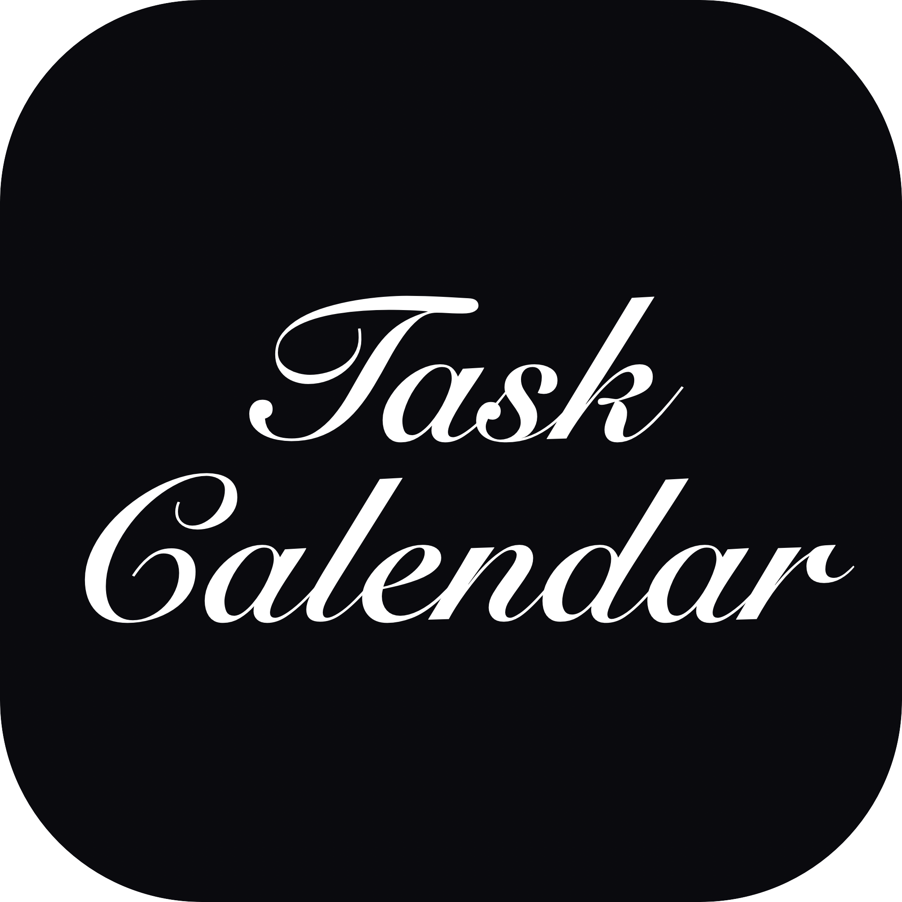

<div align="center">



# 桌面任务日历 · Desktop Task Calendar

**一个为 macOS 原生打造的本地拖拽式任务日历。**

输入任务 → 拖进月历排期 → 边缘拖拽调整跨度，全程离线、零云端、零遥测。

[](https://www.apple.com/macos/)
[](https://developer.apple.com/xcode/swiftui/)
[](LICENSE)
[](#安装)

</div>

---

## ✨ 为什么是它

市面上的日历 App 要么绑账号、要么上云、要么把简单的事做复杂。
这是一个**只做一件事**的小工具：把待办任务像卡片一样，**用鼠标拖到月历上排好期**。

- 🔒 **纯本地** —— 数据只落在你自己的 `~/Library/...`，不上传、不同步、无遥测
- 🖱️ **拖拽优先** —— 拖中间平移、拖左右边缘改起止日，按天自动吸附
- 🎨 **6 套完整主题 × 浅/深模式** —— 低饱和、莫兰迪调，深色模式单独设计而非反色
- ⚡ **原生 SwiftUI** —— 标准 macOS 窗口、红绿灯按钮、Launchpad 图标，系统级手感

## 🖥️ 界面速览

<div align="center">

</div>

> 应用图标为黑底白色英文花体字 *Task / Calendar*，已注册到 Launchpad。

## 🎛️ 交互方式

| 操作 | 效果 |
|---|---|
| 顶部输入名称 + 回车 | 新增任务，右侧色点选标签色 |
| 待办胶囊 → 日历日期 | 拖上去即排期（默认占一天） |
| 拖任务条**中间** | 整体平移到别的日期 |
| 拖任务条**右边缘** | 延长 / 缩短结束日 |
| 拖任务条**左边缘** | 调整开始日 |
| 右键任务条 | 移除排期（回待办）/ 删除任务 |
| 顶栏画笔图标 | 切换 6 套主题 |
| 顶栏月亮 / 太阳 | 切换浅 / 深色模式 |
| 左上角 | 上 / 下月、「回到今天」 |

跨周任务自动跨行显示（跨行同色连续、行尾渐隐延续、**每一行都显示任务名称**、末行显示时间范围）；同一日期可排多个任务，重叠/交叉自动分泳道堆叠；长名称自动换行（任务条随标题行数自适应加高），不再用省略号截断；左右两端有同色系拖拽把手，悬停/拖动高亮放大；拖动实时跟随鼠标所在日期，一次可连续跨多行。

## 🎨 主题一览

| 主题 | 风格 | 品牌色 | 深色基调 |
|---|---|---|---|
| 🌿 薄荷巧克力 | 清凉薄荷 × 深可可 | 薄荷绿 | 深可可黑 |
| 🍋 柠檬汽水 | 柠檬黄 × 汽水青 × 冰白 | 柠檬黄 | 深青黑 |
| 🍫 巧克力可可 | 可可棕 × 奶油 × 焦糖 | 可可棕 | 深巧克力 |
| 🍑 蜜桃气泡 | 蜜桃粉 × 汽水蓝 | 蜜桃粉 | 深灰紫 |
| 🌊 海盐焦糖 | 焦糖棕 × 海盐蓝 | 焦糖棕 | 深海军黑 |
| 🍵 抹茶拿铁 | 抹茶绿 × 奶白 × 燕麦金 | 抹茶绿 | 深抹茶黑 |

每套主题都包含完整语义色板：品牌 / 按下态 / 五级背景 / 四级文字 / 边框分割线 / 遮罩阴影 / 7 种任务状态色 / 4 种优先级色 / 8 色标签板 / 6 色图表板，全部低饱和、无纯红纯绿纯蓝。

## 📦 安装

### 方式一：下载安装包（推荐）

从仓库下载 [`桌面任务日历-v2.0.zip`](桌面任务日历-v2.0.zip)，解压后把 `TaskCalendar.app` 拖入 `/Applications` 即可。

> **首次打开提示"无法验证开发者"？**
> 前往「系统设置 → 隐私与安全性」点击「仍要打开」，或在终端执行：
> ```bash
> xattr -dr com.apple.quarantine /Applications/TaskCalendar.app
> ```

### 方式二：从源码构建

需要 **macOS 13+** 与 **Xcode Command Line Tools**：

```bash
cd TaskCalendar
swift build -c release
# 把编译产物塞进预建的 .app 包结构
cp .build/release/TaskCalendar ../TaskCalendar.app/Contents/MacOS/TaskCalendar
codesign --force --deep -s - ../TaskCalendar.app
open ../TaskCalendar.app
```

## 🗂️ 仓库结构

```
├── TaskCalendar/               # SwiftPM 源码
│   ├── Package.swift           # macOS 13+ 清单
│   ├── Sources/TaskCalendar.swift   # 数据层 / 拖拽月历 / 多主题 UI
│   ├── Info.plist
│   └── make_icon.swift         # 图标生成脚本
├── TaskCalendar.app/           # 预构建好的 App（可直接运行）
├── 桌面任务日历-v2.0.zip       # 分发包
├── icon.png                    # 应用图标
└── README.md
```

## 🔐 数据与隐私

- 所有任务保存在本机：`~/Library/Application Support/DesktopTaskCalendar/tasks.json`
- 删除该文件即清空全部数据，**没有任何云端备份**
- 窗口位置自动记忆，重启后保留
- 不请求网络权限、不收集任何遥测

## 🗺️ Roadmap

- [ ] 任务优先级与状态标记
- [ ] 本地 iCloud / 可选同步
- [ ] 自然语言输入（"下周三下午3点开会"）
- [ ] 周视图 / 议程视图切换

## 📜 更新记录

<details>
<summary>展开全部版本历史</summary>

- **v2.0**（2026-09-30）：支持同一日期排多个任务（重叠/交叉自动泳道堆叠，任务条高度随泳道数与标题换行自适应）；窗口可缩放到更小尺寸（最小 520×440）且全 UI 自适应；任务条文字垂直居中、字距随跨度适度延长；跨行任务每行都显示名称、末行保留时间；长名称自动换行不再省略号截断；单格任务正常显示名称；任务条配色重构（浅色模式用主题品牌对比色、深色模式压暗彩块+主题浅色文字，新增同色系细描边）；任务颜色选择不再自动跳转；顶栏新增「固定到桌面」+ 菜单栏 ⌘P 切换（保持可交互，跨桌面空间跟随）。
- **v1.9**（2026-09-30）：跨行任务连续显示（分段圆角 / 渐隐延续 / 周末降透明）+ 同色系拖拽把手（40%→100% 悬停放大、激活切强调色）+ 绝对位置实时拖拽（任务条跟随鼠标，斜向跨行不断线）。
- **v1.8**（2026-09-29）：6 套主题整体清透化提亮；「添加」按钮改单色填充；顶栏按钮颜色跟随主题，深色模式下不再隐身。
- **v1.7**（2026-09-29）：主题系统重构为 6 套高差异化主题，每套含浅 / 深完整语义色；新增明暗切换按钮。
- **v1.6**（2026-09-29）：加入主题系统，顶栏一键切换并记忆；任务颜色跟随主题标签色板。
- **v1.5**（2026-09-29）：图标改为黑底白色英文花体字；UI 换莫兰迪色调；月份标题突出显示。
- **v1.4**（2026-09-29）：彻底移除小组件；GitHub 风格扁平低饱和 UI；修复拖拽遮挡日期数字的 bug。
- **v1.3**（2026-09-29）：移除桌面小组件；界面圆润化。
- **v1.2**（2026-09-29）：液态玻璃质感；小组件支持缩放与视图切换。
- **v1.1**（2026-09-29）：改为原生 macOS 应用。
- **v1.0**（2026-09-29）：首个本地可用版本。

</details>

## 📄 License

[MIT](LICENSE) © unim1012-netizen
